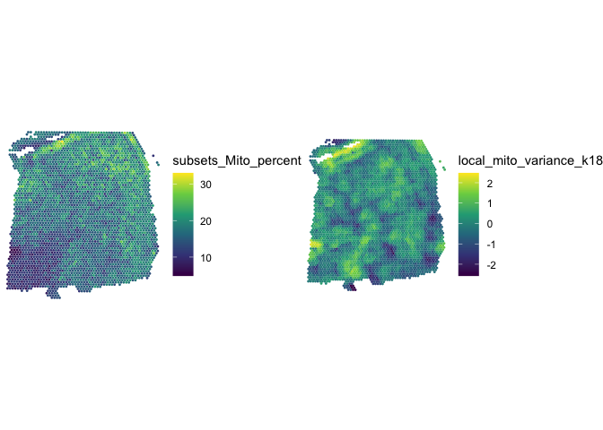

<!-- README.md is generated from README.Rmd. Please edit that file -->

# SpotSweeper (under development)

<!-- badges: start -->

[](https://lifecycle.r-lib.org/articles/stages.html#experimental)
[](https://github.com/MicTott/SpotSweeper/actions/workflows/R-CMD-check.yaml)
<!-- badges: end -->

`SpotSweeper` is a BioConductor package for spatially-aware quality
control (QC) methods for the detection, visualization, and removal of
local outliers in spot-based spatial transcriptomics data, such as 10x
Genomics `Visium`, using standard QC metrics.

## Installation instructions (in progress)

Get the latest stable `R` release from
[CRAN](http://cran.r-project.org/). Then install `SpotSweeper` from
[Bioconductor](http://bioconductor.org/) using the following code:

``` r
if (!requireNamespace("BiocManager", quietly = TRUE)) {
    install.packages("BiocManager")
}

BiocManager::install("SpotSweeper")
```

And the development version from
[GitHub](https://github.com/MicTott/SpotSweeper) with:

``` r
BiocManager::install("MicTott/SpotSweeper")
```

## Tutorial (in progress)

A detailed tutorial is available in the package vignette from
Bioconductor. A direct link to the tutorial / package vignette is
available here.

## Input data format

In the examples below, we assume the input data are provided as a
SpatialExperiment (SPE) object. The outputs for spot-level outliers are
stored in the colData of the SPE object.

(FUTURE TODO) Alternatively, the inputs can also be provided as a
numeric matrix of normalized and transformed counts
(e.g. log-transformed normalized counts, also known as logcounts) and a
numeric matrix of spatial coordinates.

## Spot-level local outlier detection

This is an exmaple workflow showing how to detect and visualize local
outliers in 10X Genomics Visium data.

``` r
library(SpotSweeper)
suppressPackageStartupMessages({
  library(SpatialExperiment)
})
#> Warning: package 'S4Vectors' was built under R version 4.3.2
#> Warning: package 'GenomeInfoDb' was built under R version 4.3.2


# load  Maynard et al DLPFC daatset
spe <- STexampleData::Visium_humanDLPFC()
#> see ?STexampleData and browseVignettes('STexampleData') for documentation
#> loading from cache

# change from gene id to gene names
rownames(spe) <- rowData(spe)$gene_name

# show column data before SpotSweeper
colnames(colData(spe))
#> [1] "barcode_id"   "sample_id"    "in_tissue"    "array_row"    "array_col"   
#> [6] "ground_truth" "cell_count"

# drop out-of-tissue spots
spe <- spe[, spe$in_tissue == 1]
spe <- spe[, !is.na(spe$ground_truth)]
```

SpotSweeper can be run on an SPE object with the following code. This
outputs the `local_outliers` in the colData of the SPE object. Selecting
`data_output=TRUE` exports z-transformed QC metrics as well.

``` r

# Identifying the mitochondrial transcripts in our SpatialExperiment.
is.mito <- rownames(spe)[grepl("^MT-", rownames(spe))]

# Calculating QC metrics for each spot using scuttle
spe<- scuttle::addPerCellQCMetrics(spe, subsets=list(Mito=is.mito))
colnames(colData(spe))
#>  [1] "barcode_id"            "sample_id"             "in_tissue"            
#>  [4] "array_row"             "array_col"             "ground_truth"         
#>  [7] "cell_count"            "sum"                   "detected"             
#> [10] "subsets_Mito_sum"      "subsets_Mito_detected" "subsets_Mito_percent" 
#> [13] "total"

# Identifying local outliers suing SpotSweeper
features <- c('sum' ,'detected', "subsets_Mito_percent")
spe<- localOutliers(spe, 
                    features=features,
                    n_neighbors=36, 
                    data_output=TRUE,
                    method="multivariate"
                    )

# show column data before SpotSweeper
colnames(colData(spe))
#>  [1] "barcode_id"                "sample_id"                
#>  [3] "in_tissue"                 "array_row"                
#>  [5] "array_col"                 "ground_truth"             
#>  [7] "cell_count"                "sum"                      
#>  [9] "detected"                  "subsets_Mito_sum"         
#> [11] "subsets_Mito_detected"     "subsets_Mito_percent"     
#> [13] "total"                     "sum_log2"                 
#> [15] "detected_log2"             "subsets_Mito_percent_log2"
#> [17] "coords"                    "local_outliers"           
#> [19] "sum_z"                     "detected_z"               
#> [21] "subsets_Mito_percent_z"    "LOF"
```

Below we can visualize `local_outliers` vs one of the QC metrics,
`sum_log2`, using the `escheR` package.

``` r
library(escheR)
#> Loading required package: ggplot2

# plotting using escheR
make_escheR(spe) |> 
  add_fill(var = "sum_log2") |>
  add_ground(var = "local_outliers", stroke = 1) +
  scale_color_manual(
    name = "", # turn off legend name for ground_truth
    values = c(
      "TRUE" = "red",
      "FALSE" = "transparent")
  ) +
  scale_fill_gradient(low ="white",high =  "darkgreen")
#> Scale for fill is already present.
#> Adding another scale for fill, which will replace the existing scale.
```


## Region-level artifact detection (in progress)

Regional artifacts, such as “smears” and tissue tears, can be visualized
and detected by calculating the local variance of mitochondrial percent
or ratio.

TODO: add example with regional artifact.

``` r

features = c("subsets_Mito_percent")

spe <- localVariance(spe, 
                     features=features,
                     n_neighbors=18, 
                     name="local_mito_variance_k18"
                     )

# show column data after calculating local variance
colnames(colData(spe))
#>  [1] "barcode_id"                "sample_id"                
#>  [3] "in_tissue"                 "array_row"                
#>  [5] "array_col"                 "ground_truth"             
#>  [7] "cell_count"                "sum"                      
#>  [9] "detected"                  "subsets_Mito_sum"         
#> [11] "subsets_Mito_detected"     "subsets_Mito_percent"     
#> [13] "total"                     "sum_log2"                 
#> [15] "detected_log2"             "subsets_Mito_percent_log2"
#> [17] "coords"                    "local_outliers"           
#> [19] "sum_z"                     "detected_z"               
#> [21] "subsets_Mito_percent_z"    "LOF"                      
#> [23] "local_mito_variance_k18"
```

``` r
library(ggpubr)

# plotting using escheR
p1 <- make_escheR(spe) |> 
  add_fill(var = "subsets_Mito_percent", point_size=1)

p2 <- make_escheR(spe) |> 
  add_fill(var = "local_mito_variance_k18", point_size=1)

plot_list <- list(p1, p2)
ggarrange(
  plotlist = plot_list,
  ncol = 2, nrow = 1,
  common.legend = FALSE)
```



## Citation

Below is the citation output from using `citation('SpotSweeper')` in R.
Please run this yourself to check for any updates on how to cite
**SpotSweeper**.

``` r
print(citation("SpotSweeper"), bibtex = TRUE)
#> To cite package 'SpotSweeper' in publications use:
#> 
#>   MicTott (2024). _SpotSweepR: an R package for the automated removal
#>   of spot artifacts from spatially-resolved transcriptomics data_.
#>   doi:10.18129/B9.bioc.SpotSweeper
#>   <https://doi.org/10.18129/B9.bioc.SpotSweeper>,
#>   https://github.com/MicTott/SpotSweeper/SpotSweeper - R package
#>   version 0.99.0, <http://www.bioconductor.org/packages/SpotSweeper>.
#> 
#> A BibTeX entry for LaTeX users is
#> 
#>   @Manual{,
#>     title = {SpotSweepR: an R package for the automated removal of spot artifacts from spatially-resolved transcriptomics data},
#>     author = {{MicTott}},
#>     year = {2024},
#>     url = {http://www.bioconductor.org/packages/SpotSweeper},
#>     note = {https://github.com/MicTott/SpotSweeper/SpotSweeper - R package version 0.99.0},
#>     doi = {10.18129/B9.bioc.SpotSweeper},
#>   }
#> 
#>   MicTott (2024). "SpotSweeper: an R package for the automated removal
#>   of spot artifacts from spatially-resolved transcriptomics data."
#>   _bioRxiv_. doi:10.1101/TODO <https://doi.org/10.1101/TODO>,
#>   <https://www.biorxiv.org/content/10.1101/TODO>.
#> 
#> A BibTeX entry for LaTeX users is
#> 
#>   @Article{,
#>     title = {SpotSweeper: an R package for the automated removal of spot artifacts from spatially-resolved transcriptomics data},
#>     author = {{MicTott}},
#>     year = {2024},
#>     journal = {bioRxiv},
#>     doi = {10.1101/TODO},
#>     url = {https://www.biorxiv.org/content/10.1101/TODO},
#>   }
```

Please note that the `SpotSweeper` was only made possible thanks to many
other R and bioinformatics software authors, which are cited either in
the vignettes and/or the paper(s) describing this package.

## Code of Conduct

Please note that the `SpotSweeper` project is released with a
[Contributor Code of
Conduct](http://bioconductor.org/about/code-of-conduct/). By
contributing to this project, you agree to abide by its terms.

## Development tools

- Continuous code testing is possible thanks to [GitHub
  actions](https://www.tidyverse.org/blog/2020/04/usethis-1-6-0/)
  through *[usethis](https://CRAN.R-project.org/package=usethis)*,
  *[remotes](https://CRAN.R-project.org/package=remotes)*, and
  *[rcmdcheck](https://CRAN.R-project.org/package=rcmdcheck)* customized
  to use [Bioconductor’s docker
  containers](https://www.bioconductor.org/help/docker/) and
  *[BiocCheck](https://bioconductor.org/packages/3.18/BiocCheck)*.
- Code coverage assessment is possible thanks to
  [codecov](https://codecov.io/gh) and
  *[covr](https://CRAN.R-project.org/package=covr)*.
- The [documentation website](http://MicTott.github.io/SpotSweeper) is
  automatically updated thanks to
  *[pkgdown](https://CRAN.R-project.org/package=pkgdown)*.
- The code is styled automatically thanks to
  *[styler](https://CRAN.R-project.org/package=styler)*.
- The documentation is formatted thanks to
  *[devtools](https://CRAN.R-project.org/package=devtools)* and
  *[roxygen2](https://CRAN.R-project.org/package=roxygen2)*.

For more details, check the `dev` directory.

This package was developed using
*[biocthis](https://bioconductor.org/packages/3.18/biocthis)*.
