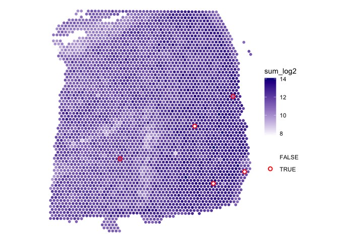
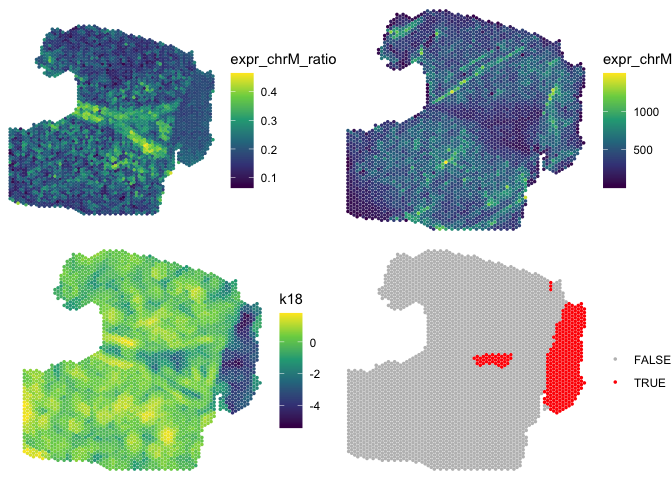

<!-- README.md is generated from README.Rmd. Please edit that file -->

# SpotSweeper

<!-- badges: start -->

[](https://lifecycle.r-lib.org/articles/stages.html#experimental)
[](https://github.com/MicTott/SpotSweeper/actions/workflows/R-CMD-check.yaml)
<!-- badges: end -->

`SpotSweeper` is a package developed for spatially-aware quality control
(QC) methods for the detection, visualization, and removal of both local
outliers and large artifacts in spot-based spatial transcriptomics data,
such as 10x Genomics `Visium`, using standard QC metrics.

## Installation instructions

Currently, the only way to install `SpotSweeper` is by downloading the
development version which can be installed from
[GitHub](https://github.com/MicTott/SpotSweeper) using the following:

``` r
if (!require("devtools")) install.packages("devtools")
remotes::install_github("MicTott/SpotSweeper")
}
```

Once accepted in [Bioconductor](http://bioconductor.org/), `SpotSweeper`
will be installable using:

``` r
if (!requireNamespace("BiocManager", quietly = TRUE)) {
    install.packages("BiocManager")
}

BiocManager::install("SpotSweeper")
```

## Tutorial (in progress)

A detailed tutorial is available in the package vignette from
Bioconductor. A direct link to the tutorial / package vignette is
available here.

## Input data format

In the examples below, we assume the input data are provided as a
[SpatialExperiment](https://github.com/drighelli/SpatialExperiment)
(SPE) object. The outputs for spot-level outliers and artifacts are
stored in the `colData` of the SPE object.

## Spot-level local outlier detection

This is an example workflow showing how to detect and visualize local
outliers in 10X Genomics Visium data.

``` r
library(SpotSweeper)


# load  Maynard et al DLPFC daatset
spe <- STexampleData::Visium_humanDLPFC()
#> Warning: package 'S4Vectors' was built under R version 4.3.2
#> Warning: package 'GenomeInfoDb' was built under R version 4.3.2
#> see ?STexampleData and browseVignettes('STexampleData') for documentation
#> loading from cache

# change from gene id to gene names
rownames(spe) <- rowData(spe)$gene_name

# show column data before SpotSweeper
colnames(colData(spe))
#> [1] "barcode_id"   "sample_id"    "in_tissue"    "array_row"    "array_col"   
#> [6] "ground_truth" "cell_count"

# drop out-of-tissue spots
spe <- spe[, spe$in_tissue == 1]
spe <- spe[, !is.na(spe$ground_truth)]
```

SpotSweeper can be run on an SPE object with the following code. This
outputs the `local_outliers` in the colData of the SPE object. Selecting
`data_output=TRUE` exports z-transformed QC metrics as well.

``` r

# Identifying the mitochondrial transcripts in our SpatialExperiment.
is.mito <- rownames(spe)[grepl("^MT-", rownames(spe))]

# Calculating QC metrics for each spot using scuttle
spe<- scuttle::addPerCellQCMetrics(spe, subsets=list(Mito=is.mito))
colnames(colData(spe))
#>  [1] "barcode_id"            "sample_id"             "in_tissue"            
#>  [4] "array_row"             "array_col"             "ground_truth"         
#>  [7] "cell_count"            "sum"                   "detected"             
#> [10] "subsets_Mito_sum"      "subsets_Mito_detected" "subsets_Mito_percent" 
#> [13] "total"

# Identifying local outliers using SpotSweeper
features <- c('sum' ,'detected', "subsets_Mito_percent")
spe<- localOutliers(spe, 
                    features=features,
                    n_neighbors=18, 
                    data_output=TRUE,
                    method="multivariate"
                    )

# show column data after SpotSweeper
colnames(colData(spe))
#>  [1] "barcode_id"                "sample_id"                
#>  [3] "in_tissue"                 "array_row"                
#>  [5] "array_col"                 "ground_truth"             
#>  [7] "cell_count"                "sum"                      
#>  [9] "detected"                  "subsets_Mito_sum"         
#> [11] "subsets_Mito_detected"     "subsets_Mito_percent"     
#> [13] "total"                     "sum_log2"                 
#> [15] "detected_log2"             "subsets_Mito_percent_log2"
#> [17] "coords"                    "local_outliers"           
#> [19] "sum_z"                     "detected_z"               
#> [21] "subsets_Mito_percent_z"    "LOF"
```

We can now visualize `local_outliers` vs one of the QC metrics,
`sum_log2`, with help from the `escheR` package.

``` r
library(escheR)
#> Loading required package: ggplot2
library(ggpubr)

# plotting using escheR
p1 <- make_escheR(spe) |> 
  add_fill(var = "sum_log2", point_size=1.25) +
  scale_fill_gradient(low ="white",high =  "darkgreen")
#> Scale for fill is already present.
#> Adding another scale for fill, which will replace the existing scale.

p2 <- make_escheR(spe) |> 
  add_fill(var = "sum_log2", point_size=1.25) |>
  add_ground(var = "local_outliers", stroke = 1) +
  scale_color_manual(
    name = "", # turn off legend name for ground_truth
    values = c(
      "TRUE" = "red",
      "FALSE" = "transparent")
  ) +
  scale_fill_gradient(low ="white",high =  "darkgreen")
#> Scale for fill is already present.
#> Adding another scale for fill, which will replace the existing scale.

plot_list <- list(p1, p2)
ggarrange(
  plotlist = plot_list,
  ncol = 2, nrow = 1,
  common.legend = FALSE
)
```



## Artifact detection

Large artifacts can be visualized and detected by calculating the local
variance of standard QC metrics, such as mitochondrial ratio.

``` r

# load in DLPFC sample with hangnail artifact
data(DLPFC_artifact)
spe <- DLPFC_artifact

# inspect colData before artifact detection
colnames(colData(spe))
#>  [1] "sample_id"          "in_tissue"          "array_row"         
#>  [4] "array_col"          "key"                "sum_umi"           
#>  [7] "sum_gene"           "expr_chrM"          "expr_chrM_ratio"   
#> [10] "ManualAnnotation"   "subject"            "region"            
#> [13] "sex"                "age"                "diagnosis"         
#> [16] "sample_id_complete" "count"              "sizeFactor"

# find artifacts using 
spe <- findArtifacts(spe, 
                     mito_percent="expr_chrM_ratio",
                     mito_sum="expr_chrM",
                     n_rings=5,
                     name="artifact"
                    )

# check that "artifact" is now in colData
colnames(colData(spe))
#>  [1] "sample_id"            "in_tissue"            "array_row"           
#>  [4] "array_col"            "key"                  "sum_umi"             
#>  [7] "sum_gene"             "expr_chrM"            "expr_chrM_ratio"     
#> [10] "ManualAnnotation"     "subject"              "region"              
#> [13] "sex"                  "age"                  "diagnosis"           
#> [16] "sample_id_complete"   "count"                "sizeFactor"          
#> [19] "expr_chrM_ratio_log2" "expr_chrM_log2"       "coords"              
#> [22] "k6"                   "k18"                  "k36"                 
#> [25] "k60"                  "k90"                  "Kmeans"              
#> [28] "artifact"
```

``` r

# plotting using escheR
p1 <- make_escheR(spe) |> 
  add_fill(var = "expr_chrM_ratio", point_size=1.25)

p2 <- make_escheR(spe) |> 
  add_fill(var = "expr_chrM", point_size=1.25)

p3 <- make_escheR(spe) |> 
  add_fill(var = "k18", point_size=1.25)
  

p4 <- make_escheR(spe) |> 
  add_fill(var = "artifact", point_size=1.25) +
  scale_fill_manual(
    name = "",
    values = c(
      "TRUE" = "red",
      "FALSE" = "grey")
  )
#> Scale for fill is already present.
#> Adding another scale for fill, which will replace the existing scale.

plot_list <- list(p1, p2, p3, p4)
ggarrange(
  plotlist = plot_list,
  ncol = 2, nrow = 2,
  common.legend = FALSE
)
```



## Citation

Please look out for our preprint describing `SpotSweeper` on bioRxiv.
Until then, please cite the package as follows:

``` r
citation("SpotSweeper")
```

## Development tools

``` r

* Continuous code testing is possible thanks to [GitHub actions](https://www.tidyverse.org/blog/2020/04/usethis-1-6-0/)  through `r BiocStyle::Biocpkg('biocthis')`.
* The [documentation website](http://MicTott.github.io/SpotSweeper) is automatically updated thanks to `r BiocStyle::CRANpkg('pkgdown')`.
* The code is styled automatically thanks to `r BiocStyle::CRANpkg('styler')`.
* The documentation is formatted thanks to `r BiocStyle::CRANpkg('devtools')` and `r BiocStyle::CRANpkg('roxygen2')`.

This package was developed using `r BiocStyle::Biocpkg('biocthis')`.
```
