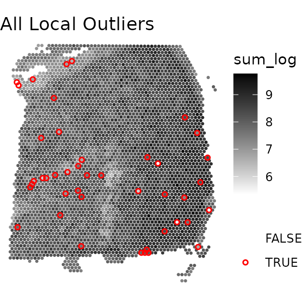
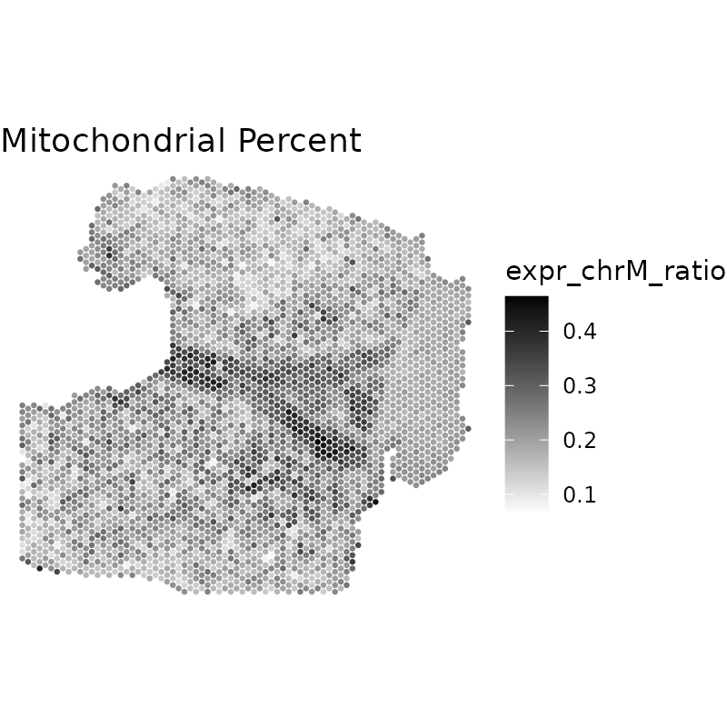
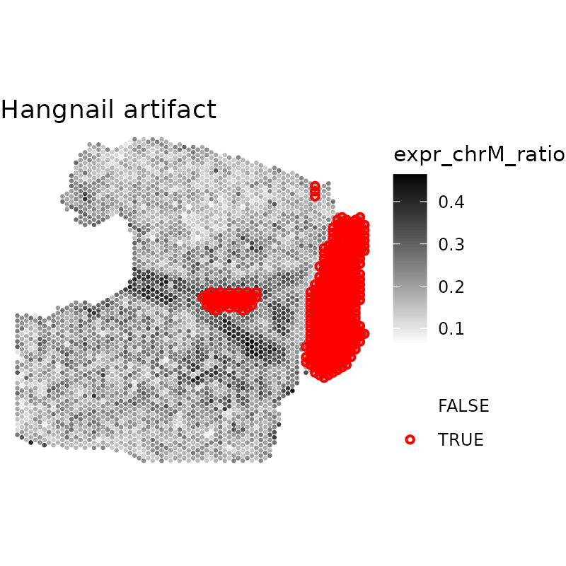

# Getting started with 'SpotSweeper'

## Introduction

`SpotSweeper` is an R package for spatial transcriptomics data quality
control (QC). It provides functions for detecting and visualizing
spot-level local outliers and artifacts using spatially-aware methods.
The package is designed to work with
[SpatialExperiment](https://github.com/drighelli/SpatialExperiment)
objects, and is compatible with data from 10X Genomics Visium and other
spatial transcriptomics platforms. Spot-level outlier detection and
systematic Visium position flagging also accept `Seurat` objects without
conversion.

### Assay and chemistry support

[`localOutliers()`](https://mictott.github.io/SpotSweeper/reference/localOutliers.md)
can use any numeric spot-level QC metric. Library size and the number of
detected genes are therefore suitable for both fresh-frozen and FFPE
data. Mitochondrial metrics should only be used when the assay measures
mitochondrial genes.

[`findArtifacts()`](https://mictott.github.io/SpotSweeper/reference/findArtifacts.md)
detects hangnail-like regional artifacts using mitochondrial signal and
is not suitable for Visium FFPE probe panels that omit mitochondrial
genes. For those assays, use
[`localOutliers()`](https://mictott.github.io/SpotSweeper/reference/localOutliers.md)
with library size or detected genes. Spatially contiguous dry-edge
regions require a region-level method and should not be interpreted as
failures of local outlier detection.

## Installation

Install the current release from
[Bioconductor](https://bioconductor.org/packages/SpotSweeper/) with:

``` r

if (!requireNamespace("BiocManager", quietly = TRUE)) {
    install.packages("BiocManager")
}

BiocManager::install("SpotSweeper")
```

The GitHub development version can be installed with:

``` r

if (!requireNamespace("remotes", quietly = TRUE)) {
    install.packages("remotes")
}
remotes::install_github("MicTott/SpotSweeper")
```

## Spot-level local outlier detection

### Loading example data

Here we’ll walk you through the standard workflow for using
‘SpotSweeper’ to detect and visualize local outliers in spatial
transcriptomics data. We’ll use the `Visium_humanDLPFC` dataset from the
`STexampleData` package, which is a `SpatialExperiment` object.

Because local outliers will be saved in the `colData` of the
`SpatialExperiment` object, we’ll first view the `colData` and drop
out-of-tissue spots before calculating quality control (QC) metrics and
running `SpotSweeper`.

``` r

library(SpotSweeper)

# load  Maynard et al DLPFC daatset
spe <- STexampleData::Visium_humanDLPFC()
```

    ## see ?STexampleData and browseVignettes('STexampleData') for documentation

    ## loading from cache

``` r

# show column data before SpotSweeper
colnames(colData(spe))
```

    ## [1] "barcode_id"   "sample_id"    "in_tissue"    "array_row"    "array_col"   
    ## [6] "ground_truth" "reference"    "cell_count"

``` r

# drop out-of-tissue spots
spe <- spe[, spe$in_tissue == 1]
```

### Calculating QC metrics using `scuttle`

We’ll use the `scuttle` package to calculate QC metrics. To do this,
we’ll need to first change the `rownames` from gene id to gene names.
We’ll then get the mitochondrial transcripts and calculate QC metrics
for each spot using
[`scuttle::addPerCellQCMetrics`](https://rdrr.io/pkg/scuttle/man/addPerCellQCMetrics.html).

``` r

# change from gene id to gene names
rownames(spe) <- rowData(spe)$gene_name

# identifying the mitochondrial transcripts
is.mito <- rownames(spe)[grepl("^MT-", rownames(spe))]

# calculating QC metrics for each spot using scuttle
spe <- scuttle::addPerCellQCMetrics(spe, subsets = list(Mito = is.mito))
```

    ## Warning in scuttle::addPerCellQCMetrics(spe, subsets = list(Mito = is.mito)): 'scuttle::addPerCellQCMetrics' is deprecated.
    ## Use 'scrapper::quickRnaQc.se' instead.
    ## See help("Deprecated")

    ## Warning in .per_cell_qc_metrics(assay(x, assay.type), subsets = subsets, : 'perCellQCMetrics' is deprecated.
    ## Use 'scrapper::computeRnaQcMetrics' instead.
    ## See help("Deprecated")

    ## using unknown matrix fallback for 'dgTMatrix'

``` r

colnames(colData(spe))
```

    ##  [1] "barcode_id"            "sample_id"             "in_tissue"            
    ##  [4] "array_row"             "array_col"             "ground_truth"         
    ##  [7] "reference"             "cell_count"            "sum"                  
    ## [10] "detected"              "subsets_Mito_sum"      "subsets_Mito_detected"
    ## [13] "subsets_Mito_percent"  "total"

### Identifying local outliers using `SpotSweeper`

We can now use `SpotSweeper` to identify local outliers in the spatial
transcriptomics data. We’ll use the `localOutliers` function to detect
local outliers based on the unique detected genes, total library size,
and percent of the total reads that are mitochondrial. These methods
assume a normal distribution, so we’ll use the log-transformed sum of
the counts and the log-transformed number of detected genes. For
mitochondrial percent, we’ll use the raw mitochondrial percentage.

``` r

# library size
spe <- localOutliers(spe,
    metric = "sum",
    direction = "lower",
    log = TRUE
)

# unique genes
spe <- localOutliers(spe,
    metric = "detected",
    direction = "lower",
    log = TRUE
)

# mitochondrial percent
spe <- localOutliers(spe,
    metric = "subsets_Mito_percent",
    direction = "higher",
    log = FALSE
)
```

The `localOutlier` function automatically outputs the results to the
`colData` with the naming convention `X_outliers`, where `X` is the name
of the input `colData`. We can then combine all outliers into a single
column called `local_outliers` in the `colData` of the
`SpatialExperiment` object.

``` r

# combine all outliers into "local_outliers" column
spe$local_outliers <- as.logical(spe$sum_outliers) |
    as.logical(spe$detected_outliers) |
    as.logical(spe$subsets_Mito_percent_outliers)
```

### Using a Seurat object

The same
[`localOutliers()`](https://mictott.github.io/SpotSweeper/reference/localOutliers.md)
call works with a Seurat object. Metrics are read from and results are
written to the object’s metadata. Coordinates are obtained from its
spatial image; alternatively, provide a numeric matrix through `coords`.

``` r

seurat <- localOutliers(
    seurat,
    metric = "nCount_Spatial",
    direction = "lower",
    samples = "orig.ident",
    log = TRUE
)

head(seurat$nCount_Spatial_z)
table(seurat$nCount_Spatial_outliers)
```

### Visualizing local outliers

We can visualize the local outliers using the `plotQCmetrics` function.
This function creates a scatter plot of the specified metric and
highlights the local outliers in red using the `escheR` package. Here,
we’ll visualize local outliers of library size, unique genes,
mitochondrial percent, and finally, all local outliers. We’ll then
arrange these plots in a grid using `ggpubr::arrange`.

``` r

library(escheR)
```

    ## Loading required package: ggplot2

``` r

# all local outliers
plotQCmetrics(spe, metric = "sum_log", outliers = "local_outliers", point_size = 1.1, 
       stroke = 0.75) +
      ggtitle("All Local Outliers")
```



## Removing technical artifacts using `SpotSweeper`

### Loading example data

``` r

# load in DLPFC sample with hangnail artifact
data(DLPFC_artifact)
spe <- DLPFC_artifact

# inspect colData before artifact detection
colnames(colData(spe))
```

    ##  [1] "sample_id"          "in_tissue"          "array_row"         
    ##  [4] "array_col"          "key"                "sum_umi"           
    ##  [7] "sum_gene"           "expr_chrM"          "expr_chrM_ratio"   
    ## [10] "ManualAnnotation"   "subject"            "region"            
    ## [13] "sex"                "age"                "diagnosis"         
    ## [16] "sample_id_complete" "count"              "sizeFactor"

### Visualizing technical artifacts

Technical artifacts can commonly be visualized by standard QC metrics,
including library size, unique genes, or mitochondrial percentage. We
can first visualize the technical artifacts using the `plotQCmetrics`
function. In this sample, we can clearly see a hangnail artifact on the
right side of the tissue section in the mitochondrial ratio plot.

``` r

plotQCmetrics(spe,
    metric = "expr_chrM_ratio",
    outliers = NULL, point_size = 1.1
) +
    ggtitle("Mitochondrial Percent")
```



### Identifying artifacts using `SpotSweeper`

We can then use the `findArtifacts` function to identify artifacts in
the spatial transcriptomics (data. This function identifies technical
artifacts based on the first principle component of the local variance
of the specified QC metric (`mito_percent`) at numerous neighorhood
sizes (`n_order=5`). Currently, `kmeans` clustering is used to cluster
the technical artifact vs high-quality Visium spots. Similar to
`localOutliers`, the `findArtifacts` function then outputs the results
to the `colData`.

``` r

# find artifacts using SpotSweeper
spe <- findArtifacts(spe,
    mito_percent = "expr_chrM_ratio",
    mito_sum = "expr_chrM",
    n_order = 5,
    name = "artifact"
)

# check that "artifact" is now in colData
colnames(colData(spe))
```

    ##  [1] "sample_id"           "in_tissue"           "array_row"          
    ##  [4] "array_col"           "key"                 "sum_umi"            
    ##  [7] "sum_gene"            "expr_chrM"           "expr_chrM_ratio"    
    ## [10] "ManualAnnotation"    "subject"             "region"             
    ## [13] "sex"                 "age"                 "diagnosis"          
    ## [16] "sample_id_complete"  "count"               "sizeFactor"         
    ## [19] "expr_chrM_ratio_log" "coords"              "k6"                 
    ## [22] "k18"                 "k36"                 "k60"                
    ## [25] "k90"                 "artifact"

### Visualizing artifacts

We can visualize the artifacts using the `escheR` package. Here, we’ll
visualize the artifacts using the `plotQCmetrics` function and arrange
these plots using `ggpubr::arrange`.

``` r

plotQCmetrics(spe,
    metric = "expr_chrM_ratio",
    outliers = "artifact", point_size = 1.1
) +
    ggtitle("Hangnail artifact")
```

 \#
Session information

``` r

utils::sessionInfo()
```

    ## R version 4.6.1 (2026-06-24)
    ## Platform: x86_64-pc-linux-gnu
    ## Running under: Ubuntu 24.04.4 LTS
    ## 
    ## Matrix products: default
    ## BLAS:   /usr/lib/x86_64-linux-gnu/openblas-pthread/libblas.so.3 
    ## LAPACK: /usr/lib/x86_64-linux-gnu/openblas-pthread/libopenblasp-r0.3.26.so;  LAPACK version 3.12.0
    ## 
    ## locale:
    ##  [1] LC_CTYPE=C.UTF-8       LC_NUMERIC=C           LC_TIME=C.UTF-8       
    ##  [4] LC_COLLATE=C.UTF-8     LC_MONETARY=C.UTF-8    LC_MESSAGES=C.UTF-8   
    ##  [7] LC_PAPER=C.UTF-8       LC_NAME=C              LC_ADDRESS=C          
    ## [10] LC_TELEPHONE=C         LC_MEASUREMENT=C.UTF-8 LC_IDENTIFICATION=C   
    ## 
    ## time zone: UTC
    ## tzcode source: system (glibc)
    ## 
    ## attached base packages:
    ## [1] stats4    stats     graphics  grDevices utils     datasets  methods  
    ## [8] base     
    ## 
    ## other attached packages:
    ##  [1] escheR_1.12.0               ggplot2_4.0.3              
    ##  [3] STexampleData_1.20.1        SpatialExperiment_1.22.0   
    ##  [5] SingleCellExperiment_1.34.0 SummarizedExperiment_1.42.0
    ##  [7] Biobase_2.72.0              GenomicRanges_1.64.0       
    ##  [9] Seqinfo_1.2.0               IRanges_2.46.0             
    ## [11] S4Vectors_0.50.2            MatrixGenerics_1.24.0      
    ## [13] matrixStats_1.5.0           ExperimentHub_3.2.2        
    ## [15] AnnotationHub_4.2.2         BiocFileCache_3.2.0        
    ## [17] dbplyr_2.6.0                BiocGenerics_0.58.1        
    ## [19] generics_0.1.4              SpotSweeper_1.9.1          
    ## [21] BiocStyle_2.40.0           
    ## 
    ## loaded via a namespace (and not attached):
    ##  [1] tidyselect_1.2.1     viridisLite_0.4.3    dplyr_1.2.1         
    ##  [4] farver_2.1.2         blob_1.3.0           Biostrings_2.80.2   
    ##  [7] filelock_1.0.3       S7_0.2.2             fastmap_1.2.0       
    ## [10] digest_0.6.39        lifecycle_1.0.5      KEGGREST_1.52.2     
    ## [13] RSQLite_3.53.3       magrittr_2.0.5       compiler_4.6.1      
    ## [16] rlang_1.3.0          sass_0.4.10          tools_4.6.1         
    ## [19] yaml_2.3.12          knitr_1.52           labeling_0.4.3      
    ## [22] S4Arrays_1.12.0      htmlwidgets_1.6.4    curl_8.0.0          
    ## [25] bit_4.6.0            DelayedArray_0.38.2  RColorBrewer_1.1-3  
    ## [28] abind_1.4-8          BiocParallel_1.46.0  withr_3.0.3         
    ## [31] purrr_1.2.2          desc_1.4.3           grid_4.6.1          
    ## [34] beachmat_2.28.0      scales_1.4.0         MASS_7.3-65         
    ## [37] cli_3.6.6            crayon_1.5.3         rmarkdown_2.32      
    ## [40] ragg_1.5.2           otel_0.2.0           httr_1.4.9          
    ## [43] rjson_0.2.23         scuttle_1.22.0       DBI_1.3.0           
    ## [46] cachem_1.1.0         parallel_4.6.1       AnnotationDbi_1.74.0
    ## [49] BiocManager_1.30.27  XVector_0.52.0       vctrs_0.7.3         
    ## [52] Matrix_1.7-5         jsonlite_2.0.0       bookdown_0.48       
    ## [55] BiocNeighbors_2.6.0  bit64_4.8.6          systemfonts_1.3.2   
    ## [58] magick_2.9.1         jquerylib_0.1.4      glue_1.8.1          
    ## [61] pkgdown_2.2.1        codetools_0.2-20     gtable_0.3.6        
    ## [64] BiocVersion_3.23.1   tibble_3.3.1         pillar_1.11.1       
    ## [67] rappdirs_0.3.4       htmltools_0.5.9      R6_2.6.1            
    ## [70] httr2_1.3.0          textshaping_1.0.5    evaluate_1.0.5      
    ## [73] lattice_0.22-9       png_0.1-9            memoise_2.0.1       
    ## [76] bslib_0.12.0         Rcpp_1.1.2           SparseArray_1.12.2  
    ## [79] xfun_0.60            fs_2.1.0             pkgconfig_2.0.3
