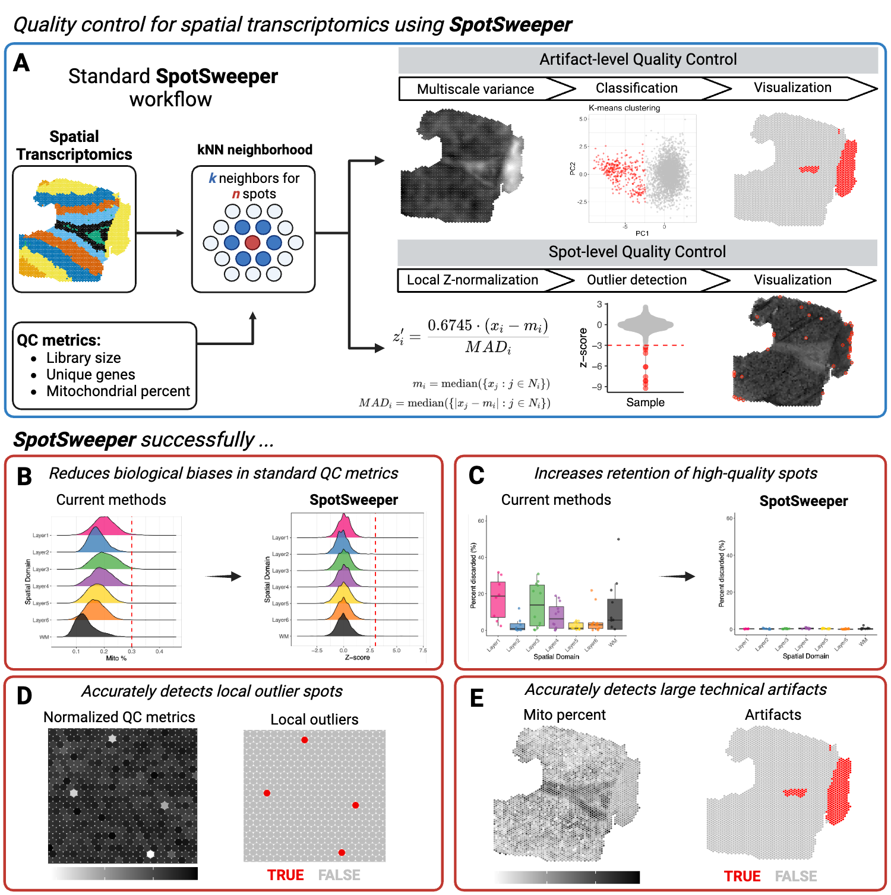

# SpotSweeper 

`SpotSweeper` is a package developed for spatially-aware quality control
(QC) methods for the detection, visualization, and removal of both local
outliers and regional artifacts in spot-based spatial transcriptomics
data, such as 10x Genomics `Visium`, using standard QC metrics.

If you experience any issues using the package or would like to make a
suggestion, please open an issue on the [GitHub
repository](https://github.com/MicTott/SpotSweeper/issues).

To find more information, please visit the [documentation
website](http://MicTott.github.io/SpotSweeper).



## Installation instructions

You can install the latest version of `SpotSweeper` from Bioconductor
with the following code:

``` r

if (!requireNamespace("BiocManager", quietly = TRUE)) {
    install.packages("BiocManager")
}

BiocManager::install("SpotSweeper")
```

The latest development version can be installed from
[GitHub](https://github.com/MicTott/SpotSweeper) using the following:

``` r

if (!require("devtools")) install.packages("devtools")
remotes::install_github("MicTott/SpotSweeper")
```

## Tutorials

A detailed tutorial is available in the package vignette from
Bioconductor. A direct link to the tutorial / package vignette is
available
[here](https://mictott.github.io/SpotSweeper/articles/getting_started.html).

## Development tools

- Continuous code testing is possible thanks to [GitHub
  actions](https://www.tidyverse.org/blog/2020/04/usethis-1-6-0/)
  through `BiocStyle::Biocpkg('biocthis')`.
- The [documentation website](http://MicTott.github.io/SpotSweeper) is
  automatically updated thanks to `BiocStyle::CRANpkg('pkgdown')`.
- The code is styled automatically thanks to
  `BiocStyle::CRANpkg('styler')`.
- The documentation is formatted thanks to
  `BiocStyle::CRANpkg('devtools')` and `BiocStyle::CRANpkg('roxygen2')`.

This package was developed using `BiocStyle::Biocpkg('biocthis')`.
